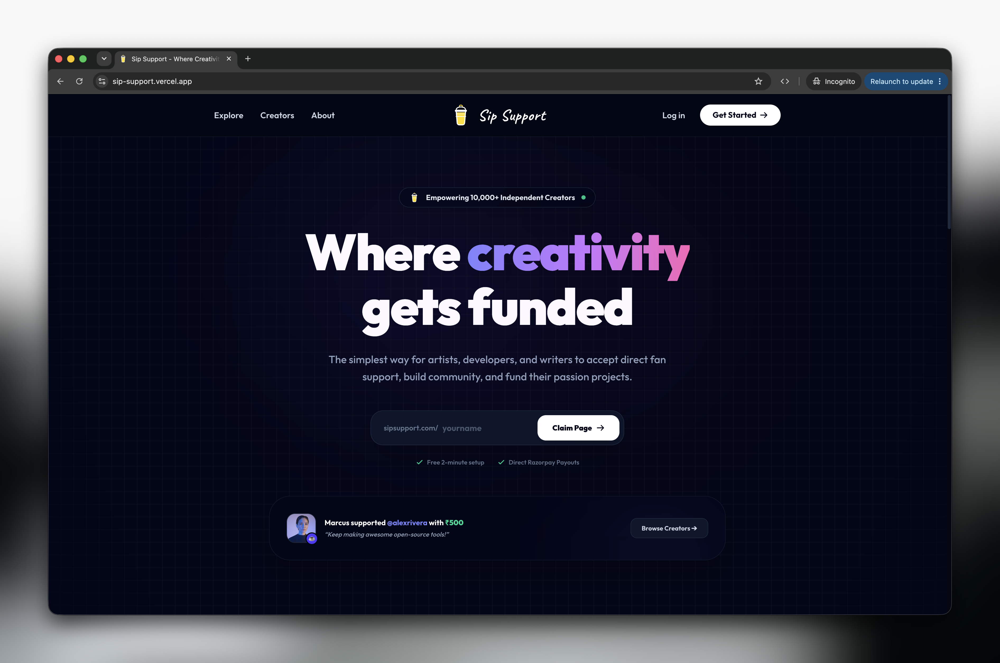
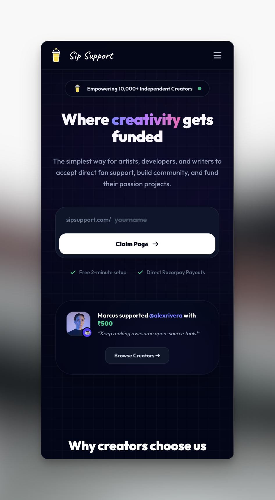

# ☕ Sip Support — Creator Crowdfunding & Direct Monetization Platform

> A creator monetization platform that enables independent creators to receive direct supporter payments through creator-managed payment integrations.

[](https://sip-support.vercel.app)
[](https://opensource.org/licenses/MIT)
[](https://nextjs.org/)
[](https://react.dev/)
[](https://tailwindcss.com/)
[](https://www.mongodb.com/atlas)
[](https://razorpay.com/)

**Live application:** https://sip-support.vercel.app

---

## Overview

Sip Support is a full-stack creator monetization platform built with Next.js.

The platform allows creators to create a public profile, connect their payment configuration, and receive payments directly from supporters. The application handles authentication, creator discovery, payment order creation, server-side payment verification, and transaction persistence.

The project was built to explore how a multi-creator payment workflow can be implemented on a serverless web architecture while keeping payment verification and sensitive operations on the server.

---

## 📸 Preview

| Desktop | Mobile |
|:---:|:---:|
| <a href="https://sip-support.vercel.app"></a> | <a href="https://sip-support.vercel.app"></a> |
| *Desktop landing experience* | *Responsive mobile experience* |

---

## ✨ Core Features

### Creator Profiles

- Custom creator handles and public profile pages
- Profile avatars and cover images
- Creator discovery and spotlight sections
- Creator-specific payment configuration

### Authentication

- GitHub OAuth authentication
- Google OAuth authentication
- Session-based authentication with NextAuth
- Automatic user provisioning

### Payment Processing

- Razorpay Checkout integration
- Creator-specific payment routing
- Server-side order creation
- Server-side payment signature verification
- Transaction status validation
- Payment records persisted in MongoDB

### Dashboard

- Creator profile management
- Payment integration management
- Public profile configuration
- Creator-specific account information

### UI & Experience

- Responsive design across desktop and mobile
- Dark glassmorphic interface
- Interactive hover and focus states
- Micro-interactions and animated UI elements
- Reusable UI components
- Mobile-first checkout experience

---

## 🏗️ Architecture

The application follows a Next.js full-stack architecture where the frontend, server-side application logic, authentication and API routes are maintained within the same codebase.

```text
                        ┌──────────────────────┐
                        │       Client         │
                        │  Next.js / React UI   │
                        └──────────┬───────────┘
                                   │
                                   ▼
                        ┌──────────────────────┐
                        │   Next.js App Router │
                        │ Server Components    │
                        │ API Route Handlers   │
                        └──────────┬───────────┘
                                   │
                 ┌─────────────────┼─────────────────┐
                 │                 │                 │
                 ▼                 ▼                 ▼
          ┌─────────────┐  ┌──────────────┐  ┌─────────────┐
          │  NextAuth   │  │   MongoDB    │  │  Razorpay   │
          │    OAuth    │  │    Atlas     │  │   Payments  │
          └─────────────┘  └──────────────┘  └─────────────┘
                                   │
                                   ▼
                           ┌────────────────┐
                           │   Deployment   │
                           │     Vercel     │
                           └────────────────┘
```

### Payment Flow

```text
Supporter
    │
    ▼
Creator Profile
    │
    ▼
Payment Request
    │
    ▼
Server-side Order Creation
    │
    ▼
Razorpay Checkout
    │
    ▼
Payment Completed
    │
    ▼
Server-side Signature Verification
    │
    ▼
Transaction Persistence
    │
    ▼
Payment Result
```

Sensitive payment operations are handled server-side rather than trusting values supplied directly by the client.

---

## 🧠 Engineering Decisions

### 1. Server-side payment verification

Payment responses cannot be treated as trusted client input.

After a payment is completed, the server validates the Razorpay signature using the relevant payment information and secret before accepting the transaction as verified.

This keeps the payment verification logic outside the browser and reduces the risk of accepting manipulated payment responses.

---

### 2. Multi-creator payment routing

Instead of processing every creator's payments through a single application-level payment configuration, the application supports creator-specific payment configurations.

The server determines which creator is receiving the payment and uses the corresponding configuration when creating the payment order.

This keeps the payment flow associated with the individual creator rather than treating all creators as one account.

---

### 3. MongoDB connection management

The application runs on serverless infrastructure where functions may be created and destroyed across separate invocations.

Creating a new MongoDB connection for every request can unnecessarily increase connection usage.

To address this, the application uses a cached Mongoose connection/promise pattern so warm serverless instances can reuse an existing connection instead of repeatedly creating new connections.

---

### 4. Dynamic creator discovery

Creator pages and discovery data are generated dynamically so newly created or updated creator information can be reflected without relying entirely on static build-time data.

The application uses Next.js server-side capabilities and MongoDB queries for this dynamic data.

---

## 🔐 Security Considerations

The project keeps security-sensitive operations on the server where possible.

Current measures include:

- OAuth authentication through NextAuth
- Server-side payment order creation
- Server-side Razorpay signature verification
- Environment variables for secrets and credentials
- `.env.local` excluded from version control
- `.env.example` provided for local setup
- Database access performed through server-side code

> Payment credentials and secrets should never be committed to the repository. Production secrets are configured through the deployment environment.

---

## 🛠️ Tech Stack

### Frontend

- **Next.js 16** — App Router
- **React 19**
- **Tailwind CSS v4**
- **Heroicons / React Icons**
- **Google Fonts — Outfit**

### Backend

- **Next.js Route Handlers**
- **Node.js**
- **NextAuth.js v4**
- **Mongoose**

### Database

- **MongoDB Atlas**

### Payments

- **Razorpay**
- Razorpay Checkout
- Razorpay Node SDK
- Server-side signature verification

### Infrastructure & Tools

- **Vercel**
- **Git**
- **GitHub**
- **npm**

---

## 📁 Project Structure

```text
sipsupport-patreonsite/
│
├── public/
│   └── assets/
│
├── screenshots/
│   ├── home.png
│   └── mobile.png
│
├── src/
│   ├── app/
│   │   ├── api/
│   │   ├── dashboard/
│   │   └── ...
│   │
│   ├── components/
│   ├── lib/
│   └── ...
│
├── .env.example
├── .gitignore
├── DEPLOYMENT_GUIDE.md
├── next.config.mjs
├── package.json
└── README.md
```

---

## 🚀 Getting Started

### Prerequisites

- Node.js 18+
- npm
- MongoDB Atlas account
- GitHub OAuth application
- Google OAuth application (optional)
- Razorpay account

### 1. Clone the repository

```bash
git clone https://github.com/hritikbytes/sipsupport-patreonsite.git
cd sipsupport-patreonsite
```

### 2. Install dependencies

```bash
npm install
```

### 3. Configure environment variables

Copy the example environment file:

```bash
cp .env.example .env.local
```

Configure the required variables:

```env
MONGODB_URI=your_mongodb_connection_string

NEXTAUTH_SECRET=your_nextauth_secret
NEXTAUTH_URL=http://localhost:3000
NEXT_PUBLIC_URL=http://localhost:3000

GITHUB_ID=your_github_client_id
GITHUB_SECRET=your_github_client_secret

GOOGLE_CLIENT_ID=your_google_client_id
GOOGLE_CLIENT_SECRET=your_google_client_secret
```

Payment credentials should be configured according to the application's creator payment integration flow.

### 4. Start the development server

```bash
npm run dev
```

Open:

```text
http://localhost:3000
```

---

## ⚙️ Environment Variables

| Variable | Purpose | Required |
|---|---|:---:|
| `MONGODB_URI` | MongoDB connection | Yes |
| `NEXTAUTH_SECRET` | NextAuth session encryption | Yes |
| `NEXTAUTH_URL` | Authentication callback URL | Yes |
| `NEXT_PUBLIC_URL` | Public application URL | Yes |
| `GITHUB_ID` | GitHub OAuth client ID | Yes |
| `GITHUB_SECRET` | GitHub OAuth secret | Yes |
| `GOOGLE_CLIENT_ID` | Google OAuth client ID | Optional |
| `GOOGLE_CLIENT_SECRET` | Google OAuth secret | Optional |

Never commit `.env.local` or production credentials to the repository.

---

## 📈 Roadmap

- [ ] Subscription and recurring memberships
- [ ] Tier-based creator memberships
- [ ] Custom creator domains
- [ ] Supporter badges and recognition
- [ ] Multi-currency payment support
- [ ] Creator analytics dashboard
- [ ] Improved transaction history
- [ ] Automated payment notifications

---

## 🔭 Future Engineering Improvements

The current implementation can be extended with:

- Automated test coverage for critical payment flows
- End-to-end testing with Playwright
- CI checks for linting, type checking and builds
- Improved payment failure and retry handling
- Rate limiting for sensitive API endpoints
- Structured application logging
- Monitoring and error tracking
- More granular authorization rules
- Automated database/index optimization

These improvements are intentionally separated from the current feature set rather than presented as implemented functionality.

---

## 📚 Documentation

- [`DEPLOYMENT_GUIDE.md`](./DEPLOYMENT_GUIDE.md) — Deployment and production configuration
- [` .env.example`](./.env.example) — Environment variable reference

---

## 🗺️ Project Status

**Status:** Active project / production deployment

The application is currently deployed and available through the live demo.

The repository is maintained as a practical full-stack web development project, with ongoing improvements planned around testing, observability, payment workflows and scalability.

---

## 👨‍💻 Developer

**Hritik Sharma**

Web Developer focused on React, Next.js and modern web application development.

- **GitHub:** [@hritikbytes](https://github.com/hritikbytes)
- **LinkedIn:** [linkedin.com/in/hritiksharma0608](https://www.linkedin.com/in/hritiksharma0608/)
- **Email:** [hritiksharma.0608@gmail.com](mailto:hritiksharma.0608@gmail.com)

---

<div align="center">

**Built by Hritik Sharma**

[Live Demo](https://sip-support.vercel.app) · [GitHub Repository](https://github.com/hritikbytes/sipsupport-patreonsite)

</div>
